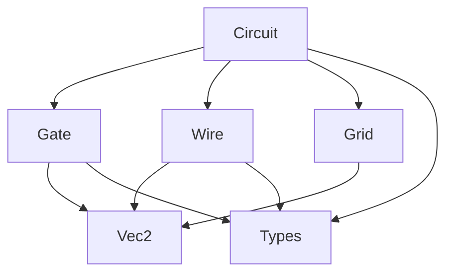

# Step 2: 데이터 구조 정의 - 기술 명세서

## 1. 기술 스택

### 1.1 프로그래밍 언어
- **C++20**: 최신 언어 기능 활용
  - Concepts for template constraints
  - Designated initializers
  - std::span for array views
  - constexpr improvements

### 1.2 컴파일러 요구사항
- **MSVC 2022** (Windows): /std:c++20
- **GCC 11+** (Linux): -std=c++20
- **Clang 13+** (Mac/Linux): -std=c++20

### 1.3 의존성
```cmake
# CMakeLists.txt 의존성
find_package(SDL2 REQUIRED)     # 이벤트 처리용
find_package(OpenGL REQUIRED)   # 향후 렌더링용
find_package(glm REQUIRED)       # 수학 연산 보조
```

## 2. 아키텍처 설계

### 2.1 레이어 구조
```
┌─────────────────────────────────┐
│         Application Layer        │ (main.cpp)
├─────────────────────────────────┤
│          Game Logic Layer        │ (Circuit, Simulation)
├─────────────────────────────────┤
│         Core Data Layer          │ (Gate, Wire, Vec2)
├─────────────────────────────────┤
│         Utility Layer            │ (Types, Math, Memory)
└─────────────────────────────────┘
```

### 2.2 모듈 의존성


## 3. 데이터 구조 상세 설계

### 3.1 Vec2 구현

#### 3.1.1 헤더 파일 (Vec2.h)
```cpp
#pragma once
#include <cmath>
#include <algorithm>

struct alignas(8) Vec2 {
    float x, y;
    
    // 생성자
    constexpr Vec2() noexcept : x(0), y(0) {}
    constexpr Vec2(float x_, float y_) noexcept : x(x_), y(y_) {}
    
    // 연산자 오버로딩
    Vec2 operator+(const Vec2& v) const noexcept { 
        return Vec2(x + v.x, y + v.y); 
    }
    Vec2 operator-(const Vec2& v) const noexcept { 
        return Vec2(x - v.x, y - v.y); 
    }
    Vec2 operator*(float s) const noexcept { 
        return Vec2(x * s, y * s); 
    }
    Vec2 operator/(float s) const noexcept { 
        return Vec2(x / s, y / s); 
    }
    
    Vec2& operator+=(const Vec2& v) noexcept {
        x += v.x; y += v.y; return *this;
    }
    Vec2& operator-=(const Vec2& v) noexcept {
        x -= v.x; y -= v.y; return *this;
    }
    Vec2& operator*=(float s) noexcept {
        x *= s; y *= s; return *this;
    }
    Vec2& operator/=(float s) noexcept {
        x /= s; y /= s; return *this;
    }
    
    // 벡터 연산
    [[nodiscard]] float length() const noexcept {
        return std::sqrt(x * x + y * y);
    }
    
    [[nodiscard]] float lengthSquared() const noexcept {
        return x * x + y * y;
    }
    
    [[nodiscard]] Vec2 normalized() const noexcept {
        float len = length();
        return len > 0 ? Vec2(x/len, y/len) : Vec2(0, 0);
    }
    
    [[nodiscard]] float dot(const Vec2& v) const noexcept {
        return x * v.x + y * v.y;
    }
    
    [[nodiscard]] float distance(const Vec2& v) const noexcept {
        return (*this - v).length();
    }
    
    [[nodiscard]] float distanceSquared(const Vec2& v) const noexcept {
        return (*this - v).lengthSquared();
    }
    
    // 유틸리티
    [[nodiscard]] bool isZero() const noexcept {
        constexpr float EPSILON = 1e-6f;
        return std::abs(x) < EPSILON && std::abs(y) < EPSILON;
    }
    
    [[nodiscard]] bool equals(const Vec2& v, float epsilon = 1e-6f) const noexcept {
        return std::abs(x - v.x) < epsilon && std::abs(y - v.y) < epsilon;
    }
};

// 전역 연산자
inline Vec2 operator*(float s, const Vec2& v) noexcept {
    return v * s;
}
```

#### 3.1.2 메모리 레이아웃
- 8바이트 정렬로 SIMD 최적화 준비
- POD 타입으로 memcpy 가능
- 캐시 라인 효율성 고려

### 3.2 Types 정의

#### 3.2.1 헤더 파일 (Types.h)
```cpp
#pragma once
#include <cstdint>
#include <limits>

// ID 타입 정의
using GateId = uint32_t;
using WireId = uint32_t;
using PortIndex = int8_t;

// 상수 정의
namespace Constants {
    constexpr GateId INVALID_GATE_ID = 0;
    constexpr WireId INVALID_WIRE_ID = 0;
    constexpr PortIndex INVALID_PORT = -2;
    constexpr PortIndex OUTPUT_PORT = -1;
    
    constexpr float GATE_DELAY = 0.1f;         // 100ms
    constexpr int MAX_INPUT_PORTS = 3;
    constexpr float GRID_CELL_SIZE = 32.0f;    // pixels
    
    // 성능 관련
    constexpr size_t GATE_POOL_SIZE = 10000;
    constexpr size_t WIRE_POOL_SIZE = 50000;
    constexpr size_t CACHE_LINE_SIZE = 64;
}

// 열거형
enum class GateType : uint8_t {
    NOT = 0,
    // 향후 확장
    // AND = 1,
    // OR = 2,
    // XOR = 3,
};

enum class SignalState : uint8_t {
    LOW = 0,
    HIGH = 1,
    UNDEFINED = 2,
    FLOATING = 3  // 연결되지 않은 상태
};

// 에러 코드
enum class ErrorCode : int32_t {
    SUCCESS = 0,
    INVALID_ID = -1,
    POSITION_OCCUPIED = -2,
    PORT_ALREADY_CONNECTED = -3,
    CIRCULAR_DEPENDENCY = -4,
    OUT_OF_BOUNDS = -5,
    OUT_OF_MEMORY = -6
};

// 결과 타입
template<typename T>
struct Result {
    T value;
    ErrorCode error;
    
    [[nodiscard]] bool isOk() const noexcept { 
        return error == ErrorCode::SUCCESS; 
    }
    [[nodiscard]] bool isError() const noexcept { 
        return error != ErrorCode::SUCCESS; 
    }
    
    // Optional-like interface
    [[nodiscard]] T& operator*() { return value; }
    [[nodiscard]] const T& operator*() const { return value; }
    [[nodiscard]] T* operator->() { return &value; }
    [[nodiscard]] const T* operator->() const { return &value; }
};
```

### 3.3 Gate 구현

#### 3.3.1 헤더 파일 (Gate.h)
```cpp
#pragma once
#include "Types.h"
#include "Vec2.h"
#include <array>

struct alignas(64) Gate {  // 캐시 라인 정렬
    // 식별 정보 (8 bytes)
    GateId id{Constants::INVALID_GATE_ID};
    GateType type{GateType::NOT};
    uint16_t _padding1{0};
    
    // 위치 정보 (8 bytes)
    Vec2 position{0, 0};
    
    // 연결 정보 (16 bytes)
    std::array<WireId, 3> inputWires{
        Constants::INVALID_WIRE_ID,
        Constants::INVALID_WIRE_ID,
        Constants::INVALID_WIRE_ID
    };
    WireId outputWire{Constants::INVALID_WIRE_ID};
    
    // 신호 상태 (8 bytes)
    SignalState currentOutput{SignalState::LOW};
    SignalState pendingOutput{SignalState::LOW};
    float delayTimer{0.0f};
    uint16_t _padding2{0};
    
    // 플래그 (8 bytes)
    bool isDirty{false};
    bool isDelayActive{false};
    uint8_t _padding3[6]{0};
    
    // 메서드
    void update(float deltaTime) noexcept;
    [[nodiscard]] SignalState calculateOutput(
        const std::array<SignalState, 3>& inputs) const noexcept;
    
    [[nodiscard]] Vec2 getInputPortPosition(PortIndex port) const noexcept;
    [[nodiscard]] Vec2 getOutputPortPosition() const noexcept;
    [[nodiscard]] PortIndex getClosestInputPort(Vec2 pos) const noexcept;
    [[nodiscard]] bool isPointInBounds(Vec2 point) const noexcept;
    
    // 연결 관리
    [[nodiscard]] bool canConnectInput(PortIndex port) const noexcept {
        return port >= 0 && port < Constants::MAX_INPUT_PORTS &&
               inputWires[port] == Constants::INVALID_WIRE_ID;
    }
    
    [[nodiscard]] bool canConnectOutput() const noexcept {
        return outputWire == Constants::INVALID_WIRE_ID;
    }
    
    void connectInput(PortIndex port, WireId wire) noexcept {
        if (port >= 0 && port < Constants::MAX_INPUT_PORTS) {
            inputWires[port] = wire;
            isDirty = true;
        }
    }
    
    void connectOutput(WireId wire) noexcept {
        outputWire = wire;
    }
    
    void disconnectInput(PortIndex port) noexcept {
        if (port >= 0 && port < Constants::MAX_INPUT_PORTS) {
            inputWires[port] = Constants::INVALID_WIRE_ID;
            isDirty = true;
        }
    }
    
    void disconnectOutput() noexcept {
        outputWire = Constants::INVALID_WIRE_ID;
    }
};

// 컴파일 타임 검증
static_assert(sizeof(Gate) == 64, "Gate should be exactly one cache line");
```

#### 3.3.2 구현 파일 (Gate.cpp)
```cpp
#include "Gate.h"
#include <algorithm>

void Gate::update(float deltaTime) noexcept {
    if (!isDelayActive) return;
    
    delayTimer -= deltaTime;
    if (delayTimer <= 0.0f) {
        currentOutput = pendingOutput;
        isDelayActive = false;
        delayTimer = 0.0f;
    }
}

SignalState Gate::calculateOutput(
    const std::array<SignalState, 3>& inputs) const noexcept {
    
    // NOT 게이트 로직: 하나라도 HIGH면 LOW, 모두 LOW면 HIGH
    for (const auto& input : inputs) {
        if (input == SignalState::HIGH) {
            return SignalState::LOW;
        }
    }
    return SignalState::HIGH;
}

Vec2 Gate::getInputPortPosition(PortIndex port) const noexcept {
    if (port < 0 || port >= Constants::MAX_INPUT_PORTS) {
        return position;
    }
    
    // 게이트 왼쪽에 수직으로 배치
    constexpr float PORT_SPACING = 0.3f;
    constexpr float PORT_OFFSET = 0.5f;
    
    float yOffset = (port - 1) * PORT_SPACING;
    return Vec2(position.x - PORT_OFFSET, position.y + yOffset);
}

Vec2 Gate::getOutputPortPosition() const noexcept {
    constexpr float PORT_OFFSET = 0.5f;
    return Vec2(position.x + PORT_OFFSET, position.y);
}

PortIndex Gate::getClosestInputPort(Vec2 pos) const noexcept {
    float minDist = std::numeric_limits<float>::max();
    PortIndex closestPort = INVALID_PORT;
    
    for (PortIndex i = 0; i < Constants::MAX_INPUT_PORTS; ++i) {
        Vec2 portPos = getInputPortPosition(i);
        float dist = pos.distanceSquared(portPos);
        if (dist < minDist) {
            minDist = dist;
            closestPort = i;
        }
    }
    
    return closestPort;
}

bool Gate::isPointInBounds(Vec2 point) const noexcept {
    constexpr float HALF_SIZE = 0.4f;
    return std::abs(point.x - position.x) <= HALF_SIZE &&
           std::abs(point.y - position.y) <= HALF_SIZE;
}
```

### 3.4 Wire 구현

#### 3.4.1 헤더 파일 (Wire.h)
```cpp
#pragma once
#include "Types.h"
#include "Vec2.h"
#include <vector>

struct Wire {
    // 식별 정보
    WireId id{Constants::INVALID_WIRE_ID};
    
    // 연결 정보
    GateId fromGateId{Constants::INVALID_GATE_ID};
    GateId toGateId{Constants::INVALID_GATE_ID};
    PortIndex fromPort{Constants::OUTPUT_PORT};  // 항상 출력 포트
    PortIndex toPort{Constants::INVALID_PORT};
    
    // 신호 상태
    SignalState signalState{SignalState::LOW};
    
    // 경로 정보 (렌더링용)
    std::vector<Vec2> pathPoints;
    
    // 메서드
    void calculatePath(const Vec2& fromPos, const Vec2& toPos) noexcept;
    [[nodiscard]] bool isPointOnWire(Vec2 point, float tolerance = 0.1f) const noexcept;
    [[nodiscard]] float distanceToPoint(Vec2 point) const noexcept;
    
    // 유효성 검사
    [[nodiscard]] bool isValid() const noexcept {
        return id != Constants::INVALID_WIRE_ID &&
               fromGateId != Constants::INVALID_GATE_ID &&
               toGateId != Constants::INVALID_GATE_ID &&
               toPort >= 0 && toPort < Constants::MAX_INPUT_PORTS;
    }
};
```

#### 3.4.2 구현 파일 (Wire.cpp)
```cpp
#include "Wire.h"
#include <algorithm>

void Wire::calculatePath(const Vec2& fromPos, const Vec2& toPos) noexcept {
    pathPoints.clear();
    pathPoints.reserve(4);  // 최대 4개 점
    
    pathPoints.push_back(fromPos);
    
    // 직선 경로 가능 여부 확인
    float dx = std::abs(toPos.x - fromPos.x);
    float dy = std::abs(toPos.y - fromPos.y);
    
    if (dx < 0.01f || dy < 0.01f) {
        // 직선 경로
        pathPoints.push_back(toPos);
    } else {
        // L자 또는 Z자 경로
        Vec2 mid1(toPos.x, fromPos.y);
        pathPoints.push_back(mid1);
        pathPoints.push_back(toPos);
    }
}

bool Wire::isPointOnWire(Vec2 point, float tolerance) const noexcept {
    if (pathPoints.size() < 2) return false;
    
    for (size_t i = 0; i < pathPoints.size() - 1; ++i) {
        const Vec2& p1 = pathPoints[i];
        const Vec2& p2 = pathPoints[i + 1];
        
        // 선분과 점 사이의 거리 계산
        Vec2 diff = p2 - p1;
        float t = std::clamp(
            (point - p1).dot(diff) / diff.lengthSquared(),
            0.0f, 1.0f
        );
        
        Vec2 closest = p1 + diff * t;
        if (closest.distance(point) <= tolerance) {
            return true;
        }
    }
    
    return false;
}

float Wire::distanceToPoint(Vec2 point) const noexcept {
    if (pathPoints.empty()) return std::numeric_limits<float>::max();
    
    float minDist = std::numeric_limits<float>::max();
    
    for (size_t i = 0; i < pathPoints.size() - 1; ++i) {
        const Vec2& p1 = pathPoints[i];
        const Vec2& p2 = pathPoints[i + 1];
        
        Vec2 diff = p2 - p1;
        float t = std::clamp(
            (point - p1).dot(diff) / diff.lengthSquared(),
            0.0f, 1.0f
        );
        
        Vec2 closest = p1 + diff * t;
        float dist = closest.distance(point);
        minDist = std::min(minDist, dist);
    }
    
    return minDist;
}
```

### 3.5 Circuit 구현

#### 3.5.1 헤더 파일 (Circuit.h)
```cpp
#pragma once
#include "Types.h"
#include "Gate.h"
#include "Wire.h"
#include <unordered_map>
#include <vector>
#include <memory>

class Circuit {
private:
    // 컨테이너
    std::unordered_map<GateId, Gate> gates;
    std::unordered_map<WireId, Wire> wires;
    
    // ID 생성
    GateId nextGateId{1};
    WireId nextWireId{1};
    
    // 시뮬레이션 상태
    float simulationTime{0.0f};
    bool isPaused{false};
    bool needsPropagation{false};
    
    // 성능 최적화용 캐시
    std::vector<GateId> dirtyGates;
    std::vector<GateId> updateOrder;  // 토폴로지 정렬
    
public:
    // 생성자/소멸자
    Circuit() = default;
    ~Circuit() = default;
    
    // 복사/이동 금지 (큰 데이터 구조)
    Circuit(const Circuit&) = delete;
    Circuit& operator=(const Circuit&) = delete;
    Circuit(Circuit&&) = default;
    Circuit& operator=(Circuit&&) = default;
    
    // 게이트 관리
    [[nodiscard]] Result<GateId> addGate(Vec2 position) noexcept;
    ErrorCode removeGate(GateId id) noexcept;
    [[nodiscard]] Gate* getGate(GateId id) noexcept;
    [[nodiscard]] const Gate* getGate(GateId id) const noexcept;
    [[nodiscard]] GateId getGateAt(Vec2 position, float tolerance = 0.5f) const noexcept;
    
    // 와이어 관리
    [[nodiscard]] Result<WireId> connectGates(
        GateId fromId, GateId toId, PortIndex toPort) noexcept;
    ErrorCode removeWire(WireId id) noexcept;
    [[nodiscard]] Wire* getWire(WireId id) noexcept;
    [[nodiscard]] const Wire* getWire(WireId id) const noexcept;
    [[nodiscard]] WireId getWireAt(Vec2 position, float tolerance = 0.1f) const noexcept;
    
    // 시뮬레이션
    void update(float deltaTime) noexcept;
    void pause() noexcept { isPaused = true; }
    void resume() noexcept { isPaused = false; }
    void reset() noexcept;
    
    // 유효성 검사
    [[nodiscard]] bool canPlaceGate(Vec2 position) const noexcept;
    [[nodiscard]] bool canConnect(
        GateId fromId, GateId toId, PortIndex toPort) const noexcept;
    [[nodiscard]] bool hasCircularDependency(
        GateId fromId, GateId toId) const noexcept;
    
    // 상태 조회
    [[nodiscard]] size_t getGateCount() const noexcept { return gates.size(); }
    [[nodiscard]] size_t getWireCount() const noexcept { return wires.size(); }
    [[nodiscard]] float getSimulationTime() const noexcept { return simulationTime; }
    [[nodiscard]] bool isRunning() const noexcept { return !isPaused; }
    
    // 반복자
    auto gatesBegin() noexcept { return gates.begin(); }
    auto gatesEnd() noexcept { return gates.end(); }
    auto wiresBegin() noexcept { return wires.begin(); }
    auto wiresEnd() noexcept { return wires.end(); }
    
private:
    void propagateSignals() noexcept;
    void updateGateInputs() noexcept;
    void updateTopologicalOrder() noexcept;
    void markGateDirty(GateId id) noexcept;
    void removeGateConnections(GateId id) noexcept;
};
```

#### 3.5.2 구현 파일 핵심 부분 (Circuit.cpp)
```cpp
#include "Circuit.h"
#include <algorithm>
#include <queue>

Result<GateId> Circuit::addGate(Vec2 position) noexcept {
    if (!canPlaceGate(position)) {
        return {Constants::INVALID_GATE_ID, ErrorCode::POSITION_OCCUPIED};
    }
    
    Gate gate;
    gate.id = nextGateId++;
    gate.type = GateType::NOT;
    gate.position = position;
    
    gates[gate.id] = std::move(gate);
    needsPropagation = true;
    
    return {gate.id, ErrorCode::SUCCESS};
}

Result<WireId> Circuit::connectGates(
    GateId fromId, GateId toId, PortIndex toPort) noexcept {
    
    if (!canConnect(fromId, toId, toPort)) {
        return {Constants::INVALID_WIRE_ID, ErrorCode::PORT_ALREADY_CONNECTED};
    }
    
    if (hasCircularDependency(fromId, toId)) {
        return {Constants::INVALID_WIRE_ID, ErrorCode::CIRCULAR_DEPENDENCY};
    }
    
    Wire wire;
    wire.id = nextWireId++;
    wire.fromGateId = fromId;
    wire.toGateId = toId;
    wire.fromPort = Constants::OUTPUT_PORT;
    wire.toPort = toPort;
    
    // 게이트 연결 정보 업데이트
    gates[fromId].connectOutput(wire.id);
    gates[toId].connectInput(toPort, wire.id);
    
    // 경로 계산
    Vec2 fromPos = gates[fromId].getOutputPortPosition();
    Vec2 toPos = gates[toId].getInputPortPosition(toPort);
    wire.calculatePath(fromPos, toPos);
    
    wires[wire.id] = std::move(wire);
    
    markGateDirty(toId);
    updateTopologicalOrder();
    
    return {wire.id, ErrorCode::SUCCESS};
}

void Circuit::update(float deltaTime) noexcept {
    if (isPaused) return;
    
    // 1. 게이트 타이머 업데이트
    for (auto& [id, gate] : gates) {
        gate.update(deltaTime);
    }
    
    // 2. 신호 전파
    if (needsPropagation || !dirtyGates.empty()) {
        propagateSignals();
    }
    
    // 3. 시뮬레이션 시간 업데이트
    simulationTime += deltaTime;
}

void Circuit::propagateSignals() noexcept {
    updateGateInputs();
    
    // 토폴로지 순서대로 처리
    for (GateId gateId : updateOrder) {
        Gate& gate = gates[gateId];
        
        if (!gate.isDirty) continue;
        
        // 입력 신호 수집
        std::array<SignalState, 3> inputs{
            SignalState::FLOATING,
            SignalState::FLOATING,
            SignalState::FLOATING
        };
        
        for (int i = 0; i < Constants::MAX_INPUT_PORTS; ++i) {
            WireId wireId = gate.inputWires[i];
            if (wireId != Constants::INVALID_WIRE_ID) {
                inputs[i] = wires[wireId].signalState;
            }
        }
        
        // 새 출력 계산
        SignalState newOutput = gate.calculateOutput(inputs);
        
        // 출력 변경 시 딜레이 시작
        if (newOutput != gate.currentOutput && !gate.isDelayActive) {
            gate.pendingOutput = newOutput;
            gate.delayTimer = Constants::GATE_DELAY;
            gate.isDelayActive = true;
        }
        
        // 출력 와이어 업데이트
        if (gate.outputWire != Constants::INVALID_WIRE_ID) {
            Wire& outWire = wires[gate.outputWire];
            if (outWire.signalState != gate.currentOutput) {
                outWire.signalState = gate.currentOutput;
                markGateDirty(outWire.toGateId);
            }
        }
        
        gate.isDirty = false;
    }
    
    dirtyGates.clear();
    needsPropagation = false;
}
```

### 3.6 Grid 구현

#### 3.6.1 헤더 파일 (Grid.h)
```cpp
#pragma once
#include "Vec2.h"
#include <algorithm>

class Grid {
private:
    float cellSize;
    Vec2 offset;      // 카메라 오프셋
    float zoom;
    
    // 경계 (옵션)
    bool hasLimits;
    Vec2 minBounds;
    Vec2 maxBounds;
    
public:
    explicit Grid(float cellSize_ = Constants::GRID_CELL_SIZE) noexcept
        : cellSize(cellSize_)
        , offset(0, 0)
        , zoom(1.0f)
        , hasLimits(false)
        , minBounds(-1000, -1000)
        , maxBounds(1000, 1000) {}
    
    // 좌표 변환
    [[nodiscard]] Vec2 screenToGrid(Vec2 screenPos) const noexcept {
        Vec2 worldPos = (screenPos - offset) / zoom;
        return worldPos / cellSize;
    }
    
    [[nodiscard]] Vec2 gridToScreen(Vec2 gridPos) const noexcept {
        Vec2 worldPos = gridPos * cellSize;
        return worldPos * zoom + offset;
    }
    
    [[nodiscard]] Vec2 snapToGrid(Vec2 pos) const noexcept {
        return Vec2(
            std::round(pos.x),
            std::round(pos.y)
        );
    }
    
    // 카메라 제어
    void pan(Vec2 delta) noexcept {
        offset += delta;
        if (hasLimits) {
            clampOffset();
        }
    }
    
    void zoomAt(Vec2 screenPos, float factor) noexcept {
        factor = std::clamp(factor, 0.1f, 10.0f);
        
        Vec2 gridPos = screenToGrid(screenPos);
        zoom *= factor;
        zoom = std::clamp(zoom, 0.25f, 4.0f);
        
        Vec2 newScreenPos = gridToScreen(gridPos);
        offset += screenPos - newScreenPos;
    }
    
    // 유효성 검사
    [[nodiscard]] bool isValidPosition(Vec2 gridPos) const noexcept {
        if (!hasLimits) return true;
        
        return gridPos.x >= minBounds.x && gridPos.x <= maxBounds.x &&
               gridPos.y >= minBounds.y && gridPos.y <= maxBounds.y;
    }
    
    // 설정
    void setLimits(Vec2 min, Vec2 max) noexcept {
        hasLimits = true;
        minBounds = min;
        maxBounds = max;
    }
    
    void removeLimits() noexcept {
        hasLimits = false;
    }
    
    // Getter
    [[nodiscard]] float getCellSize() const noexcept { return cellSize; }
    [[nodiscard]] float getZoom() const noexcept { return zoom; }
    [[nodiscard]] Vec2 getOffset() const noexcept { return offset; }
    
private:
    void clampOffset() noexcept {
        // 화면 경계 제한 로직
        Vec2 minScreen = gridToScreen(minBounds);
        Vec2 maxScreen = gridToScreen(maxBounds);
        
        offset.x = std::clamp(offset.x, minScreen.x, maxScreen.x);
        offset.y = std::clamp(offset.y, minScreen.y, maxScreen.y);
    }
};
```

## 4. 메모리 관리

### 4.1 메모리 풀
```cpp
template<typename T, size_t PoolSize>
class MemoryPool {
private:
    alignas(Constants::CACHE_LINE_SIZE) 
    std::array<T, PoolSize> pool;
    
    std::vector<T*> available;
    std::vector<T*> inUse;
    
public:
    MemoryPool() {
        available.reserve(PoolSize);
        for (size_t i = 0; i < PoolSize; ++i) {
            available.push_back(&pool[i]);
        }
    }
    
    [[nodiscard]] T* allocate() noexcept {
        if (available.empty()) return nullptr;
        
        T* ptr = available.back();
        available.pop_back();
        inUse.push_back(ptr);
        return ptr;
    }
    
    void deallocate(T* ptr) noexcept {
        auto it = std::find(inUse.begin(), inUse.end(), ptr);
        if (it != inUse.end()) {
            inUse.erase(it);
            available.push_back(ptr);
        }
    }
};
```

### 4.2 캐시 최적화
- Structure of Arrays (SoA) 대신 Array of Structures (AoS) 사용
- 캐시 라인 정렬 (64바이트)
- Hot/Cold 데이터 분리

## 5. 성능 프로파일링

### 5.1 측정 지표
```cpp
struct PerformanceMetrics {
    float updateTime;       // 업데이트 시간 (ms)
    float propagationTime;  // 신호 전파 시간 (ms)
    size_t gateUpdates;     // 업데이트된 게이트 수
    size_t signalChanges;   // 신호 변경 횟수
    float memoryUsage;      // 메모리 사용량 (MB)
};
```

### 5.2 프로파일러 통합
```cpp
#ifdef ENABLE_PROFILING
    #define PROFILE_SCOPE(name) ProfileScope _prof(name)
    #define PROFILE_FUNCTION() PROFILE_SCOPE(__FUNCTION__)
#else
    #define PROFILE_SCOPE(name)
    #define PROFILE_FUNCTION()
#endif

class ProfileScope {
    const char* name;
    std::chrono::high_resolution_clock::time_point start;
    
public:
    explicit ProfileScope(const char* n) : name(n) {
        start = std::chrono::high_resolution_clock::now();
    }
    
    ~ProfileScope() {
        auto end = std::chrono::high_resolution_clock::now();
        auto duration = std::chrono::duration_cast<std::chrono::microseconds>
                       (end - start).count();
        // 프로파일링 데이터 기록
    }
};
```

## 6. 테스트 전략

### 6.1 단위 테스트 프레임워크
```cpp
// 간단한 테스트 매크로
#define TEST(name) void test_##name()
#define ASSERT_EQ(a, b) if ((a) != (b)) throw std::runtime_error(#a " != " #b)
#define ASSERT_TRUE(x) if (!(x)) throw std::runtime_error(#x " is false")
#define ASSERT_FALSE(x) if (x) throw std::runtime_error(#x " is true")

// 테스트 예제
TEST(vec2_addition) {
    Vec2 a(1, 2);
    Vec2 b(3, 4);
    Vec2 c = a + b;
    ASSERT_EQ(c.x, 4.0f);
    ASSERT_EQ(c.y, 6.0f);
}
```

### 6.2 통합 테스트
```cpp
void testSimpleCircuit() {
    Circuit circuit;
    
    // 3개 게이트 체인
    auto g1 = circuit.addGate(Vec2(0, 0));
    auto g2 = circuit.addGate(Vec2(2, 0));
    auto g3 = circuit.addGate(Vec2(4, 0));
    
    ASSERT_TRUE(g1.isOk());
    ASSERT_TRUE(g2.isOk());
    ASSERT_TRUE(g3.isOk());
    
    // 연결
    auto w1 = circuit.connectGates(*g1, *g2, 0);
    auto w2 = circuit.connectGates(*g2, *g3, 1);
    
    ASSERT_TRUE(w1.isOk());
    ASSERT_TRUE(w2.isOk());
    
    // 시뮬레이션
    for (int i = 0; i < 10; ++i) {
        circuit.update(0.016f);  // 60 FPS
    }
}
```

## 7. 빌드 설정

### 7.1 CMakeLists.txt 업데이트
```cmake
# Core 라이브러리
add_library(notgate_core STATIC
    src/core/Types.h
    src/core/Vec2.h
    src/core/Vec2.cpp
    src/core/Gate.h
    src/core/Gate.cpp
    src/core/Wire.h
    src/core/Wire.cpp
    src/core/Circuit.h
    src/core/Circuit.cpp
    src/core/Grid.h
    src/core/Grid.cpp
)

target_compile_features(notgate_core PUBLIC cxx_std_20)
target_include_directories(notgate_core PUBLIC src/core)

# 컴파일 옵션
if(MSVC)
    target_compile_options(notgate_core PRIVATE
        /W4 /WX /permissive- /Zc:__cplusplus
        /fp:fast /arch:AVX2
    )
else()
    target_compile_options(notgate_core PRIVATE
        -Wall -Wextra -Werror
        -march=native -ffast-math
    )
endif()

# 테스트
if(BUILD_TESTS)
    add_executable(test_core
        tests/test_vec2.cpp
        tests/test_gate.cpp
        tests/test_circuit.cpp
    )
    target_link_libraries(test_core notgate_core)
endif()
```

## 8. 디버깅 지원

### 8.1 어서션
```cpp
#ifdef DEBUG
    #define ASSERT(cond, msg) \
        if (!(cond)) { \
            std::cerr << "Assertion failed: " << msg << "\n" \
                     << "File: " << __FILE__ << "\n" \
                     << "Line: " << __LINE__ << std::endl; \
            std::abort(); \
        }
#else
    #define ASSERT(cond, msg) ((void)0)
#endif
```

### 8.2 로깅
```cpp
enum class LogLevel {
    DEBUG = 0,
    INFO = 1,
    WARNING = 2,
    ERROR = 3
};

class Logger {
    static LogLevel currentLevel;
    
public:
    template<typename... Args>
    static void log(LogLevel level, const char* fmt, Args&&... args) {
        if (level >= currentLevel) {
            // 로그 출력
        }
    }
};

#define LOG_DEBUG(...) Logger::log(LogLevel::DEBUG, __VA_ARGS__)
#define LOG_INFO(...) Logger::log(LogLevel::INFO, __VA_ARGS__)
#define LOG_ERROR(...) Logger::log(LogLevel::ERROR, __VA_ARGS__)
```

## 9. 문서화

### 9.1 Doxygen 주석
```cpp
/**
 * @brief NOT 게이트를 나타내는 구조체
 * 
 * 3개의 입력 포트와 1개의 출력 포트를 가지며,
 * 입력 중 하나라도 HIGH면 LOW를 출력한다.
 * 
 * @note 출력 변경 시 0.1초 딜레이가 적용된다.
 */
struct Gate {
    /**
     * @brief 게이트 업데이트
     * @param deltaTime 프레임 시간 (초)
     */
    void update(float deltaTime) noexcept;
};
```

## 10. 검증 체크리스트

- [ ] 모든 코드가 C++20으로 컴파일
- [ ] 메모리 누수 없음 (Valgrind/AddressSanitizer)
- [ ] 캐시 라인 정렬 확인
- [ ] 100개 게이트 60 FPS 달성
- [ ] 단위 테스트 모두 통과
- [ ] 통합 테스트 성공
- [ ] 프로파일링 데이터 수집 가능
- [ ] 디버그 빌드에서 어서션 동작
- [ ] 문서화 완료