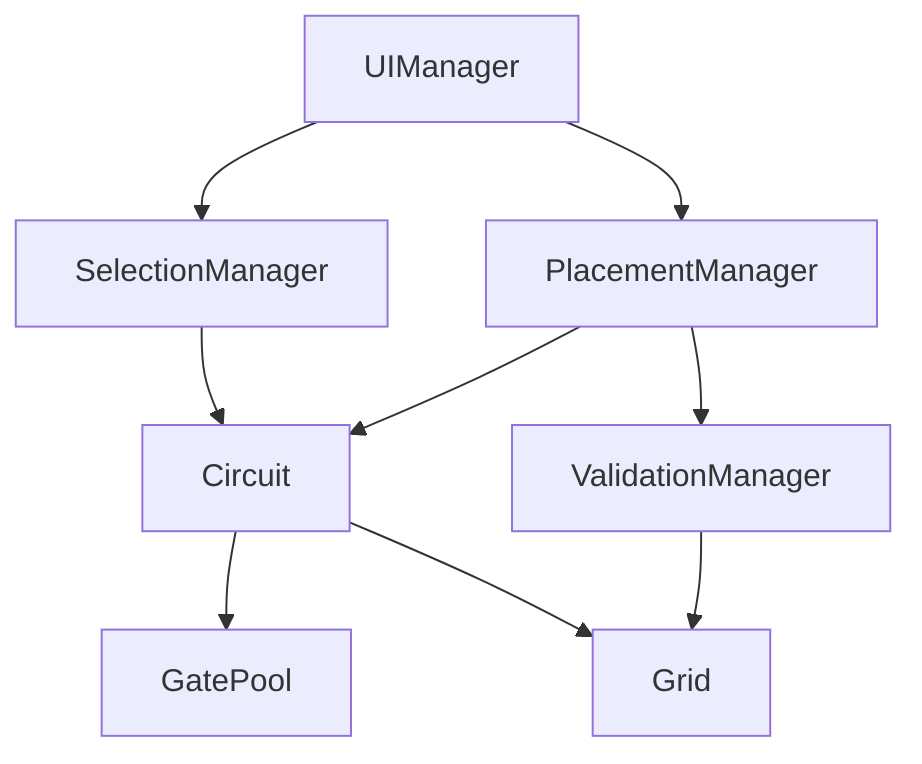

# Step 5: 게이트 배치 시스템 기술 명세서

## 1. 아키텍처 개요

### 1.1 시스템 구조
```
┌─────────────────────────────────────────────────────┐
│                    UI Layer                         │
│  ┌─────────────┐  ┌─────────────┐  ┌─────────────┐│
│  │ UIManager   │  │GatePalette  │  │ StatusBar   ││
│  └──────┬──────┘  └──────┬──────┘  └──────┬──────┘│
└─────────┼─────────────────┼────────────────┼───────┘
          │                 │                │
┌─────────▼─────────────────▼────────────────▼───────┐
│                  Game Logic Layer                   │
│  ┌─────────────┐  ┌─────────────┐  ┌─────────────┐│
│  │PlacementMgr │  │SelectionMgr │  │ValidationMgr││
│  └──────┬──────┘  └──────┬──────┘  └──────┬──────┘│
└─────────┼─────────────────┼────────────────┼───────┘
          │                 │                │
┌─────────▼─────────────────▼────────────────▼───────┐
│                   Core Layer                        │
│  ┌─────────────┐  ┌─────────────┐  ┌─────────────┐│
│  │  Circuit    │  │    Grid     │  │  GatePool   ││
│  └─────────────┘  └─────────────┘  └─────────────┘│
└─────────────────────────────────────────────────────┘
```

### 1.2 모듈 의존성


## 2. 핵심 데이터 구조

### 2.1 Gate 구조체
```cpp
struct Gate {
    uint32_t id;                    // 고유 식별자
    GateType type;                  // 게이트 타입 (현재는 NOT만)
    Vec2i gridPosition;             // 그리드 좌표
    
    // 포트 정보
    std::array<uint32_t, 3> inputConnections;   // 입력 연결 ID (-1 = 미연결)
    uint32_t outputConnection;                   // 출력 연결 ID
    
    // 시뮬레이션 상태
    uint8_t currentOutput;          // 현재 출력값 (0 or 1)
    float outputDelay;              // 남은 딜레이 시간
    
    // 렌더링 정보
    bool isSelected;                // 선택 상태
    bool isHovered;                 // 호버 상태
    float animationTime;            // 애니메이션 타이머
};

// 메모리 레이아웃 최적화 (64바이트 정렬)
static_assert(sizeof(Gate) <= 64, "Gate size exceeds cache line");
```

### 2.2 Grid 시스템
```cpp
class Grid {
private:
    static constexpr int CHUNK_SIZE = 32;  // 청크 크기
    
    struct Chunk {
        std::array<uint32_t, CHUNK_SIZE * CHUNK_SIZE> cells;  // 게이트 ID 저장
        bool isDirty;                                          // 렌더링 갱신 필요
        
        Chunk() : isDirty(false) {
            cells.fill(INVALID_ID);
        }
    };
    
    std::unordered_map<Vec2i, Chunk, Vec2iHash> chunks;  // 스파스 청크 맵
    Vec2i worldMin, worldMax;                             // 월드 경계
    
public:
    // 그리드 접근
    uint32_t GetCell(Vec2i pos) const;
    void SetCell(Vec2i pos, uint32_t gateId);
    void ClearCell(Vec2i pos);
    
    // 청크 관리
    Chunk* GetChunk(Vec2i chunkCoord);
    void MarkChunkDirty(Vec2i chunkCoord);
    
    // 유틸리티
    Vec2i WorldToChunk(Vec2i worldPos) const;
    Vec2i WorldToLocal(Vec2i worldPos) const;
};
```

### 2.3 PlacementManager
```cpp
class PlacementManager {
public:
    enum class PlacementMode {
        None,
        PlacingGate,
        PlacingWire  // 향후 확장
    };
    
private:
    PlacementMode currentMode;
    GateType selectedGateType;
    Vec2i previewPosition;
    bool isPreviewValid;
    bool continuousPlacement;  // Shift 키 연속 배치
    
    // 캐시
    std::vector<Vec2i> recentPlacements;  // 최근 배치 위치
    
public:
    // 모드 관리
    void EnterPlacementMode(GateType type);
    void ExitPlacementMode();
    
    // 프리뷰
    void UpdatePreview(Vec2i gridPos);
    bool ValidatePosition(Vec2i gridPos);
    
    // 배치
    uint32_t PlaceGate(Vec2i gridPos);
    void CancelPlacement();
    
    // 이벤트 처리
    void OnMouseMove(Vec2 screenPos);
    void OnMouseClick(MouseButton btn, Vec2 screenPos);
    void OnKeyPress(Key key);
};
```

### 2.4 SelectionManager
```cpp
class SelectionManager {
private:
    std::unordered_set<uint32_t> selectedGates;  // 선택된 게이트 ID
    uint32_t lastSelectedGate;                    // 마지막 선택 게이트
    Vec2i selectionStart;                         // 범위 선택 시작점
    bool isRangeSelecting;                        // 범위 선택 중
    
public:
    // 선택 관리
    void SelectGate(uint32_t gateId);
    void DeselectGate(uint32_t gateId);
    void ClearSelection();
    void ToggleSelection(uint32_t gateId);
    
    // 범위 선택 (향후 구현)
    void StartRangeSelection(Vec2i start);
    void UpdateRangeSelection(Vec2i current);
    void EndRangeSelection();
    
    // 선택 쿼리
    bool IsSelected(uint32_t gateId) const;
    const std::unordered_set<uint32_t>& GetSelection() const;
    
    // 선택 작업
    void DeleteSelected();
    void MoveSelected(Vec2i delta);  // 향후 구현
};
```

## 3. 메모리 관리

### 3.1 Gate Pool
```cpp
class GatePool {
private:
    static constexpr size_t POOL_SIZE = 10000;
    static constexpr size_t BLOCK_SIZE = 1000;
    
    struct Block {
        alignas(64) std::array<Gate, BLOCK_SIZE> gates;
        std::bitset<BLOCK_SIZE> used;
        uint32_t freeCount;
        
        Block() : freeCount(BLOCK_SIZE) {
            used.reset();
        }
    };
    
    std::vector<std::unique_ptr<Block>> blocks;
    std::vector<uint32_t> freeList;  // 재사용 가능한 ID 리스트
    uint32_t nextId;
    
public:
    Gate* Allocate();
    void Deallocate(uint32_t id);
    Gate* GetGate(uint32_t id);
    
    // 통계
    size_t GetUsedCount() const;
    size_t GetCapacity() const;
};
```

### 3.2 메모리 레이아웃
```cpp
// Structure of Arrays (SoA) for cache efficiency
struct GateArrays {
    alignas(64) std::vector<uint32_t> ids;
    alignas(64) std::vector<Vec2i> positions;
    alignas(64) std::vector<uint8_t> outputs;
    alignas(64) std::vector<float> delays;
    
    void Reserve(size_t capacity) {
        ids.reserve(capacity);
        positions.reserve(capacity);
        outputs.reserve(capacity);
        delays.reserve(capacity);
    }
};
```

## 4. 알고리즘

### 4.1 유효성 검사 알고리즘
```cpp
bool PlacementManager::ValidatePosition(Vec2i gridPos) {
    // 1. 경계 검사 - O(1)
    if (!grid.IsInBounds(gridPos)) {
        return false;
    }
    
    // 2. 점유 검사 - O(1)
    uint32_t existingId = grid.GetCell(gridPos);
    if (existingId != INVALID_ID) {
        return false;
    }
    
    // 3. 인접 와이어 충돌 검사 - O(4)
    static const Vec2i neighbors[] = {{0,1}, {1,0}, {0,-1}, {-1,0}};
    for (const auto& offset : neighbors) {
        Vec2i neighborPos = gridPos + offset;
        if (circuit.HasWireAt(neighborPos)) {
            // 와이어가 게이트 포트에 연결 가능한지 확인
            if (!CanConnectToPort(gridPos, neighborPos)) {
                return false;
            }
        }
    }
    
    return true;
}
```

### 4.2 선택 알고리즘
```cpp
uint32_t SelectionManager::GetGateAtPosition(Vec2i gridPos) {
    // 그리드에서 직접 조회 - O(1)
    uint32_t gateId = grid.GetCell(gridPos);
    
    // 유효성 확인
    if (gateId != INVALID_ID) {
        Gate* gate = gatePool.GetGate(gateId);
        if (gate && gate->gridPosition == gridPos) {
            return gateId;
        }
    }
    
    return INVALID_ID;
}
```

### 4.3 삭제 알고리즘
```cpp
void Circuit::RemoveGate(uint32_t gateId) {
    Gate* gate = gatePool.GetGate(gateId);
    if (!gate) return;
    
    // 1. 연결된 와이어 제거 - O(connections)
    for (uint32_t inputId : gate->inputConnections) {
        if (inputId != INVALID_ID) {
            RemoveWire(inputId);
        }
    }
    if (gate->outputConnection != INVALID_ID) {
        RemoveWire(gate->outputConnection);
    }
    
    // 2. 그리드에서 제거 - O(1)
    grid.ClearCell(gate->gridPosition);
    
    // 3. 선택 상태 제거 - O(1)
    selectionManager.DeselectGate(gateId);
    
    // 4. 메모리 반환 - O(1)
    gatePool.Deallocate(gateId);
    
    // 5. 렌더링 갱신 플래그
    grid.MarkChunkDirty(grid.WorldToChunk(gate->gridPosition));
}
```

## 5. 렌더링 시스템

### 5.1 배치 렌더링
```cpp
class GateBatchRenderer {
private:
    struct InstanceData {
        Vec2 position;
        Vec4 color;
        float selected;
        float hovered;
    };
    
    GLuint vao, vbo, instanceVBO;
    GLuint shaderProgram;
    std::vector<InstanceData> instances;
    
public:
    void BeginBatch();
    void AddGate(const Gate& gate);
    void EndBatch();
    void Render(const Camera& camera);
};
```

### 5.2 셰이더 프로그램
```glsl
// Vertex Shader
#version 330 core
layout (location = 0) in vec2 aPos;
layout (location = 1) in vec2 aInstancePos;
layout (location = 2) in vec4 aInstanceColor;
layout (location = 3) in float aSelected;
layout (location = 4) in float aHovered;

uniform mat4 uProjection;
uniform mat4 uView;

out vec4 FragColor;
out float Selected;
out float Hovered;

void main() {
    vec2 worldPos = aPos + aInstancePos;
    gl_Position = uProjection * uView * vec4(worldPos, 0.0, 1.0);
    FragColor = aInstanceColor;
    Selected = aSelected;
    Hovered = aHovered;
}

// Fragment Shader
#version 330 core
in vec4 FragColor;
in float Selected;
in float Hovered;

out vec4 outColor;

uniform float uTime;

void main() {
    vec4 color = FragColor;
    
    // 선택 하이라이트
    if (Selected > 0.5) {
        color = mix(color, vec4(1.0, 1.0, 0.0, 1.0), 0.3);
    }
    
    // 호버 효과
    if (Hovered > 0.5) {
        color = mix(color, vec4(1.0, 1.0, 1.0, 1.0), 0.2);
    }
    
    // 애니메이션 글로우
    float glow = sin(uTime * 3.0) * 0.1 + 0.9;
    outColor = color * glow;
}
```

### 5.3 프리뷰 렌더링
```cpp
void RenderPreview(Vec2i gridPos, bool isValid) {
    // 반투명 설정
    glEnable(GL_BLEND);
    glBlendFunc(GL_SRC_ALPHA, GL_ONE_MINUS_SRC_ALPHA);
    
    // 색상 설정
    Vec4 color = isValid ? 
        Vec4(0.0f, 1.0f, 0.0f, 0.5f) :  // 초록색 반투명
        Vec4(1.0f, 0.0f, 0.0f, 0.5f);   // 빨간색 반투명
    
    // 게이트 프리뷰 렌더링
    DrawGateQuad(gridPos, color);
    
    // 유효하지 않은 경우 X 표시
    if (!isValid) {
        DrawX(gridPos, Vec4(1.0f, 0.0f, 0.0f, 1.0f));
    }
    
    glDisable(GL_BLEND);
}
```

## 6. 이벤트 시스템

### 6.1 이벤트 디스패처
```cpp
class EventDispatcher {
private:
    struct EventHandler {
        std::function<void(const Event&)> callback;
        int priority;
    };
    
    std::unordered_map<EventType, std::vector<EventHandler>> handlers;
    
public:
    template<typename T>
    void Subscribe(EventType type, std::function<void(const T&)> callback, int priority = 0);
    
    void Dispatch(const Event& event);
    void Queue(std::unique_ptr<Event> event);
    void ProcessQueue();
};
```

### 6.2 게이트 이벤트
```cpp
struct GatePlacedEvent : Event {
    uint32_t gateId;
    Vec2i position;
    GateType type;
};

struct GateRemovedEvent : Event {
    uint32_t gateId;
    Vec2i position;
};

struct GateSelectedEvent : Event {
    uint32_t gateId;
    bool isMultiSelect;
};
```

## 7. 최적화 전략

### 7.1 공간 분할
```cpp
class SpatialIndex {
private:
    struct Node {
        AABB bounds;
        std::vector<uint32_t> gateIds;
        std::unique_ptr<Node> children[4];
        
        bool IsLeaf() const { return !children[0]; }
    };
    
    std::unique_ptr<Node> root;
    static constexpr int MAX_DEPTH = 8;
    static constexpr int MAX_ITEMS_PER_NODE = 32;
    
public:
    void Insert(uint32_t gateId, Vec2i position);
    void Remove(uint32_t gateId);
    std::vector<uint32_t> Query(const AABB& region);
};
```

### 7.2 더티 플래그 시스템
```cpp
class DirtyFlagSystem {
private:
    std::bitset<MAX_CHUNKS> dirtyChunks;
    std::queue<Vec2i> dirtyQueue;
    
public:
    void MarkDirty(Vec2i chunkCoord) {
        int index = ChunkToIndex(chunkCoord);
        if (!dirtyChunks[index]) {
            dirtyChunks[index] = true;
            dirtyQueue.push(chunkCoord);
        }
    }
    
    void ProcessDirtyChunks() {
        while (!dirtyQueue.empty()) {
            Vec2i chunk = dirtyQueue.front();
            dirtyQueue.pop();
            
            UpdateChunkRendering(chunk);
            dirtyChunks[ChunkToIndex(chunk)] = false;
        }
    }
};
```

### 7.3 SIMD 최적화
```cpp
// AVX2를 사용한 대량 유효성 검사
void ValidateMultiplePositions(const Vec2i* positions, bool* results, size_t count) {
    // 8개씩 병렬 처리
    for (size_t i = 0; i < count; i += 8) {
        __m256i posX = _mm256_loadu_si256((__m256i*)&positions[i].x);
        __m256i posY = _mm256_loadu_si256((__m256i*)&positions[i].y);
        
        // 경계 검사
        __m256i minX = _mm256_set1_epi32(0);
        __m256i maxX = _mm256_set1_epi32(gridWidth);
        __m256i validX = _mm256_and_si256(
            _mm256_cmpgt_epi32(posX, minX),
            _mm256_cmpgt_epi32(maxX, posX)
        );
        
        // 결과 저장
        _mm256_storeu_si256((__m256i*)&results[i], validX);
    }
}
```

## 8. 스레드 안전성

### 8.1 동기화 전략
```cpp
class ThreadSafeCircuit {
private:
    mutable std::shared_mutex gateMutex;     // 읽기/쓰기 락
    mutable std::shared_mutex gridMutex;     
    std::atomic<uint32_t> nextGateId{0};
    
public:
    // 읽기 작업 (여러 스레드 동시 가능)
    Gate* GetGate(uint32_t id) const {
        std::shared_lock lock(gateMutex);
        return gatePool.GetGate(id);
    }
    
    // 쓰기 작업 (배타적 접근)
    uint32_t AddGate(const Gate& gate) {
        std::unique_lock lock(gateMutex);
        uint32_t id = nextGateId.fetch_add(1);
        // ... 게이트 추가 로직
        return id;
    }
};
```

## 9. 에러 처리

### 9.1 에러 코드
```cpp
enum class PlacementError {
    None = 0,
    OutOfBounds,
    PositionOccupied,
    WireConflict,
    MemoryFull,
    InvalidGateType
};

struct PlacementResult {
    bool success;
    uint32_t gateId;
    PlacementError error;
    std::string errorMessage;
};
```

### 9.2 예외 처리
```cpp
class PlacementException : public std::runtime_error {
public:
    PlacementError error;
    Vec2i position;
    
    PlacementException(PlacementError err, Vec2i pos, const std::string& msg)
        : std::runtime_error(msg), error(err), position(pos) {}
};
```

## 10. 성능 메트릭

### 10.1 프로파일링 포인트
```cpp
class PerformanceMonitor {
private:
    struct Metric {
        double totalTime;
        uint64_t callCount;
        double minTime;
        double maxTime;
    };
    
    std::unordered_map<std::string, Metric> metrics;
    
public:
    class ScopedTimer {
        std::string name;
        std::chrono::high_resolution_clock::time_point start;
        PerformanceMonitor* monitor;
        
    public:
        ScopedTimer(const std::string& n, PerformanceMonitor* m);
        ~ScopedTimer();
    };
    
    void RecordTime(const std::string& name, double time);
    void PrintReport();
};

#define PROFILE(name) PerformanceMonitor::ScopedTimer _timer(name, &perfMonitor)
```

### 10.2 성능 목표
| 작업 | 목표 시간 | 측정 방법 |
|------|----------|----------|
| 게이트 배치 | < 1ms | 단일 게이트 |
| 유효성 검사 | < 0.1ms | 단일 위치 |
| 선택 처리 | < 0.5ms | 단일 클릭 |
| 삭제 처리 | < 2ms | 연결 포함 |
| 프리뷰 렌더링 | < 16ms | 60 FPS |
| 배치 렌더링 | < 5ms | 1000 게이트 |

## 11. 테스트 전략

### 11.1 유닛 테스트
```cpp
TEST(GatePoolTest, AllocateAndDeallocate) {
    GatePool pool;
    
    // 할당 테스트
    Gate* gate1 = pool.Allocate();
    ASSERT_NE(gate1, nullptr);
    
    uint32_t id = gate1->id;
    
    // 해제 테스트
    pool.Deallocate(id);
    
    // 재사용 테스트
    Gate* gate2 = pool.Allocate();
    ASSERT_EQ(gate2->id, id);  // ID 재사용 확인
}

TEST(GridTest, SetAndGetCell) {
    Grid grid;
    Vec2i pos(5, 10);
    uint32_t gateId = 42;
    
    grid.SetCell(pos, gateId);
    ASSERT_EQ(grid.GetCell(pos), gateId);
    
    grid.ClearCell(pos);
    ASSERT_EQ(grid.GetCell(pos), INVALID_ID);
}
```

### 11.2 통합 테스트
```cpp
TEST(PlacementSystemTest, EndToEndPlacement) {
    PlacementManager placement;
    Circuit circuit;
    
    // 배치 모드 진입
    placement.EnterPlacementMode(GateType::NOT);
    
    // 유효한 위치에 배치
    Vec2i validPos(10, 10);
    uint32_t gateId = placement.PlaceGate(validPos);
    
    ASSERT_NE(gateId, INVALID_ID);
    ASSERT_EQ(circuit.GetGate(gateId)->gridPosition, validPos);
    
    // 같은 위치에 재배치 시도 (실패해야 함)
    uint32_t duplicateId = placement.PlaceGate(validPos);
    ASSERT_EQ(duplicateId, INVALID_ID);
}
```

## 12. 디버깅 도구

### 12.1 디버그 렌더링
```cpp
class DebugRenderer {
public:
    void DrawGrid(const Grid& grid);
    void DrawGateIds(const Circuit& circuit);
    void DrawSelectionBox(const SelectionManager& selection);
    void DrawValidationOverlay(Vec2i pos, bool isValid);
    void DrawPerformanceStats(const PerformanceMonitor& monitor);
};
```

### 12.2 콘솔 명령
```cpp
class DebugConsole {
public:
    void RegisterCommands() {
        AddCommand("place_gate", [](Vec2i pos) {
            // 강제 게이트 배치
        });
        
        AddCommand("clear_all", []() {
            // 모든 게이트 제거
        });
        
        AddCommand("show_stats", []() {
            // 통계 표시
        });
    }
};
```