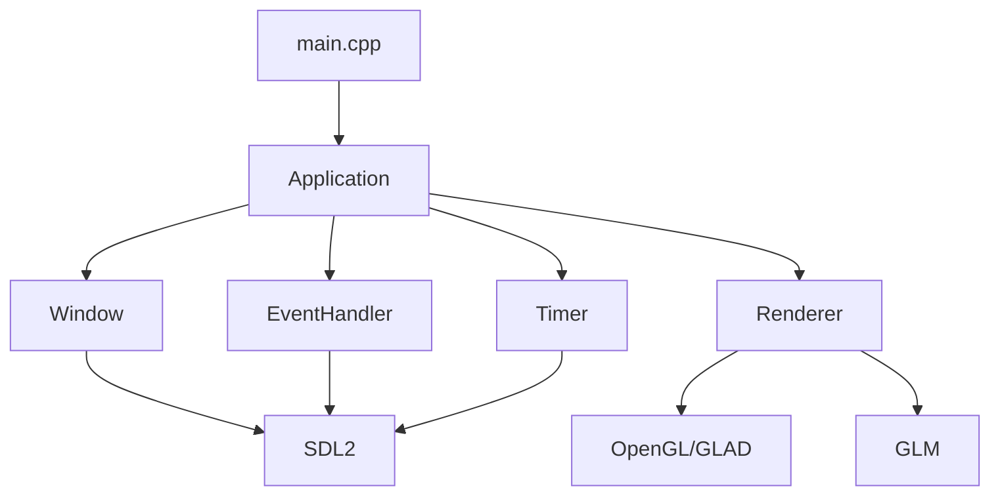

# SDL2 + OpenGL 기본 윈도우 기술 명세서

## 1. 기술 스택 상세

### 1.1 핵심 라이브러리
| 라이브러리 | 버전 | 용도 | 라이선스 |
|----------|------|------|---------|
| SDL2 | 2.26.0+ | 윈도우 관리, 입력 처리 | zlib |
| OpenGL | 3.3 Core | 그래픽 렌더링 | - |
| GLAD | 0.1.36 | OpenGL 로더 | MIT |
| GLM | 0.9.9.8 | 수학 라이브러리 | MIT |
| stb_image | 2.28 | 이미지 로딩 (향후) | Public Domain |

### 1.2 빌드 도구
| 도구 | 버전 | 용도 |
|-----|------|------|
| CMake | 3.20+ | 빌드 시스템 |
| vcpkg | latest | 패키지 관리 (Windows) |
| pkg-config | 0.29+ | 패키지 관리 (Linux) |
| Homebrew | latest | 패키지 관리 (macOS) |

## 2. 시스템 아키텍처

### 2.1 레이어 구조
```
┌─────────────────────────────────────┐
│          Application Layer          │
├─────────────────────────────────────┤
│         Window Management           │
├─────────────────────────────────────┤
│        Rendering Pipeline           │
├─────────────────────────────────────┤
│      Platform Abstraction           │
├─────────────────────────────────────┤
│    SDL2 / OpenGL / OS Services     │
└─────────────────────────────────────┘
```

### 2.2 모듈 의존성


## 3. 메모리 관리

### 3.1 메모리 할당 전략
```cpp
// 커스텀 메모리 풀 (향후 확장)
class MemoryPool {
public:
    static void* Allocate(size_t size, size_t alignment = 16);
    static void Deallocate(void* ptr);
    static size_t GetUsedMemory();
    static size_t GetTotalMemory();
    
private:
    static constexpr size_t POOL_SIZE = 64 * 1024 * 1024; // 64MB
    alignas(64) static uint8_t s_memoryPool[POOL_SIZE];
    static size_t s_offset;
};
```

### 3.2 리소스 생명주기
| 리소스 | 생성 시점 | 파괴 시점 | 관리 방식 |
|--------|----------|----------|-----------|
| SDL Window | App::Initialize | App::Shutdown | unique_ptr |
| GL Context | Window::Create | Window::~Window | SDL 자동 관리 |
| Framebuffer | Renderer::Init | Renderer::~Renderer | RAII |
| Event Queue | SDL_Init | SDL_Quit | SDL 내부 관리 |

## 4. OpenGL 파이프라인

### 4.1 렌더링 상태 머신
```cpp
struct GLState {
    // 뷰포트
    struct {
        GLint x, y, width, height;
    } viewport;
    
    // 클리어 색상
    struct {
        GLfloat r, g, b, a;
    } clearColor;
    
    // 활성화 상태
    struct {
        bool depthTest;
        bool blending;
        bool culling;
        bool wireframe;
    } enables;
    
    // 블렌딩 모드
    struct {
        GLenum srcFactor;
        GLenum dstFactor;
    } blending;
};
```

### 4.2 셰이더 관리 (기본 구조)
```cpp
class ShaderProgram {
public:
    bool LoadFromString(const std::string& vertexSrc, 
                       const std::string& fragmentSrc);
    bool LoadFromFile(const std::string& vertexPath, 
                     const std::string& fragmentPath);
    
    void Use();
    void SetUniform(const std::string& name, float value);
    void SetUniform(const std::string& name, const glm::mat4& matrix);
    
private:
    GLuint m_programID;
    std::unordered_map<std::string, GLint> m_uniformLocations;
    
    GLuint CompileShader(GLenum type, const std::string& source);
    bool LinkProgram(GLuint vertexShader, GLuint fragmentShader);
};
```

### 4.3 기본 정점 셰이더
```glsl
#version 330 core
layout (location = 0) in vec3 aPos;
layout (location = 1) in vec4 aColor;

out vec4 vertexColor;

uniform mat4 uProjection;
uniform mat4 uView;
uniform mat4 uModel;

void main() {
    gl_Position = uProjection * uView * uModel * vec4(aPos, 1.0);
    vertexColor = aColor;
}
```

### 4.4 기본 프래그먼트 셰이더
```glsl
#version 330 core
in vec4 vertexColor;
out vec4 FragColor;

void main() {
    FragColor = vertexColor;
}
```

## 5. 이벤트 시스템

### 5.1 이벤트 큐 구조
```cpp
template<typename T>
class RingBuffer {
public:
    explicit RingBuffer(size_t capacity)
        : m_buffer(capacity), m_capacity(capacity) {}
    
    bool Push(const T& item);
    bool Pop(T& item);
    bool IsEmpty() const;
    size_t Size() const;
    
private:
    std::vector<T> m_buffer;
    size_t m_head = 0;
    size_t m_tail = 0;
    size_t m_size = 0;
    size_t m_capacity;
    mutable std::mutex m_mutex;
};
```

### 5.2 이벤트 디스패처
```cpp
class EventDispatcher {
public:
    using EventCallback = std::function<void(const Event&)>;
    
    void Subscribe(Event::Type type, EventCallback callback);
    void Unsubscribe(Event::Type type, size_t id);
    void Dispatch(const Event& event);
    
private:
    std::unordered_map<Event::Type, 
                       std::vector<std::pair<size_t, EventCallback>>> m_callbacks;
    size_t m_nextID = 0;
};
```

## 6. 플랫폼별 구현

### 6.1 Windows 특화
```cpp
#ifdef _WIN32
class WindowsPlatform {
public:
    static void EnableHighDPI();
    static void SetProcessDPIAware();
    static HWND GetNativeHandle(SDL_Window* window);
    static void ShowMessageBox(const std::string& title, 
                               const std::string& message);
};

// WGL 확장 함수
typedef BOOL (WINAPI * PFNWGLSWAPINTERVALEXTPROC)(int interval);
#endif
```

### 6.2 Linux 특화
```cpp
#ifdef __linux__
class LinuxPlatform {
public:
    static Display* GetX11Display();
    static Window GetX11Window(SDL_Window* window);
    static bool IsWayland();
    static void SetWindowClass(SDL_Window* window, 
                              const std::string& name);
};

// GLX 확장
#include <GL/glx.h>
typedef void (*PFNGLXSWAPINTERVALEXTPROC)(Display*, GLXDrawable, int);
#endif
```

### 6.3 macOS 특화
```cpp
#ifdef __APPLE__
class MacPlatform {
public:
    static void* GetNSWindow(SDL_Window* window);
    static void EnableRetinaSupport(SDL_Window* window);
    static float GetBackingScaleFactor();
    static void SetupMenuBar();
};
#endif
```

## 7. 성능 최적화

### 7.1 CPU 최적화
```cpp
// 캐시 친화적 데이터 구조
struct alignas(64) CacheAlignedData {
    // 자주 접근하는 데이터를 같은 캐시 라인에
    float deltaTime;
    uint32_t frameCount;
    bool isRunning;
    uint8_t padding[64 - sizeof(float) - sizeof(uint32_t) - sizeof(bool)];
};

// SIMD 최적화 (향후)
#include <immintrin.h>
inline void ClearColorBuffer_AVX(float* buffer, size_t count, 
                                 float r, float g, float b, float a) {
    __m256 color = _mm256_set_ps(a, b, g, r, a, b, g, r);
    for (size_t i = 0; i < count; i += 8) {
        _mm256_store_ps(buffer + i, color);
    }
}
```

### 7.2 GPU 최적화
```cpp
// 상태 변경 최소화
class StateCache {
public:
    void BindTexture(GLuint texture);
    void UseProgram(GLuint program);
    void BindVAO(GLuint vao);
    
private:
    GLuint m_currentTexture = 0;
    GLuint m_currentProgram = 0;
    GLuint m_currentVAO = 0;
    
    bool HasChanged(GLuint current, GLuint next) {
        return current != next;
    }
};
```

## 8. 디버깅 지원

### 8.1 OpenGL 디버그 콜백
```cpp
void APIENTRY GLDebugCallback(GLenum source, GLenum type, GLuint id,
                              GLenum severity, GLsizei length,
                              const GLchar* message, const void* userParam) {
    if (severity == GL_DEBUG_SEVERITY_HIGH) {
        Logger::Error("GL Error: " + std::string(message));
        #ifdef DEBUG
        __debugbreak(); // Windows
        // raise(SIGTRAP); // Linux/Mac
        #endif
    }
}

void EnableGLDebug() {
    glEnable(GL_DEBUG_OUTPUT);
    glEnable(GL_DEBUG_OUTPUT_SYNCHRONOUS);
    glDebugMessageCallback(GLDebugCallback, nullptr);
    glDebugMessageControl(GL_DONT_CARE, GL_DONT_CARE, 
                         GL_DEBUG_SEVERITY_NOTIFICATION, 0, nullptr, GL_FALSE);
}
```

### 8.2 성능 프로파일링
```cpp
class GPUTimer {
public:
    void Begin();
    void End();
    float GetElapsedTime(); // milliseconds
    
private:
    GLuint m_queries[2];
    int m_currentQuery = 0;
};

class CPUProfiler {
public:
    struct ProfileData {
        std::string name;
        std::chrono::high_resolution_clock::time_point start;
        std::chrono::high_resolution_clock::time_point end;
        float duration; // milliseconds
    };
    
    static void Begin(const std::string& name);
    static void End(const std::string& name);
    static void PrintReport();
    
private:
    static std::unordered_map<std::string, ProfileData> s_profiles;
};

// 매크로 헬퍼
#define PROFILE_SCOPE(name) ScopedProfiler _prof(name)

class ScopedProfiler {
public:
    ScopedProfiler(const std::string& name) : m_name(name) {
        CPUProfiler::Begin(name);
    }
    ~ScopedProfiler() {
        CPUProfiler::End(m_name);
    }
private:
    std::string m_name;
};
```

## 9. 에러 복구

### 9.1 컨텍스트 복구
```cpp
class ContextRecovery {
public:
    static bool TryRecoverContext(Window* window);
    static void SaveGLState(GLState& state);
    static void RestoreGLState(const GLState& state);
    
private:
    static bool RecreateContext(Window* window);
    static bool ReloadResources();
};
```

### 9.2 Fallback 메커니즘
```cpp
class RenderFallback {
public:
    static bool TryModernPath();  // OpenGL 3.3+
    static bool TryLegacyPath();  // OpenGL 2.1
    static bool TrySoftwarePath(); // Mesa/Software
    
    static std::string GetBestAvailablePath();
};
```

## 10. 빌드 설정

### 10.1 CMake 구성
```cmake
# OpenGL 설정
find_package(OpenGL REQUIRED)

# SDL2 설정
if(WIN32)
    find_package(SDL2 CONFIG REQUIRED)
    target_link_libraries(notgate3 PRIVATE SDL2::SDL2 SDL2::SDL2main)
else()
    find_package(PkgConfig REQUIRED)
    pkg_check_modules(SDL2 REQUIRED sdl2)
    target_include_directories(notgate3 PRIVATE ${SDL2_INCLUDE_DIRS})
    target_link_libraries(notgate3 PRIVATE ${SDL2_LIBRARIES})
endif()

# GLAD 설정
add_library(glad STATIC 
    ${CMAKE_SOURCE_DIR}/external/glad/src/glad.c)
target_include_directories(glad PUBLIC 
    ${CMAKE_SOURCE_DIR}/external/glad/include)

# 컴파일 옵션
if(MSVC)
    target_compile_options(notgate3 PRIVATE 
        /W4 /WX /permissive- /std:c++20 /arch:AVX2)
else()
    target_compile_options(notgate3 PRIVATE 
        -Wall -Wextra -Werror -std=c++20 -mavx2)
endif()

# 프로파일 빌드
if(CMAKE_BUILD_TYPE STREQUAL "Profile")
    target_compile_definitions(notgate3 PRIVATE PROFILING_ENABLED)
    if(MSVC)
        target_compile_options(notgate3 PRIVATE /Zi)
        target_link_options(notgate3 PRIVATE /PROFILE)
    else()
        target_compile_options(notgate3 PRIVATE -pg)
        target_link_options(notgate3 PRIVATE -pg)
    endif()
endif()
```

### 10.2 전처리기 정의
```cpp
// 빌드 구성
#ifdef DEBUG
    #define GL_CHECK_ERROR() CheckGLError(__FILE__, __LINE__)
    #define ASSERT(x) assert(x)
    #define LOG_DEBUG(msg) Logger::Debug(msg)
#else
    #define GL_CHECK_ERROR()
    #define ASSERT(x)
    #define LOG_DEBUG(msg)
#endif

// 플랫폼 감지
#if defined(_WIN32)
    #define PLATFORM_WINDOWS
#elif defined(__linux__)
    #define PLATFORM_LINUX
#elif defined(__APPLE__)
    #define PLATFORM_MACOS
#endif

// OpenGL 버전
#define GL_VERSION_MAJOR 3
#define GL_VERSION_MINOR 3
#define GLSL_VERSION "#version 330 core"
```

## 11. 테스트 전략

### 11.1 단위 테스트
```cpp
// Google Test 사용
TEST(WindowTest, Creation) {
    Window window("Test", 800, 600);
    ASSERT_TRUE(window.Create());
    ASSERT_EQ(window.GetWidth(), 800);
    ASSERT_EQ(window.GetHeight(), 600);
}

TEST(RendererTest, Initialization) {
    Window window("Test", 800, 600);
    window.Create();
    
    Renderer renderer;
    ASSERT_TRUE(renderer.Initialize(&window));
}
```

### 11.2 통합 테스트
```cpp
class IntegrationTest {
public:
    static bool TestFullPipeline();
    static bool TestEventFlow();
    static bool TestRenderLoop();
    static bool TestMemoryLeaks();
};
```

## 12. 보안 고려사항

### 12.1 입력 검증
```cpp
class InputValidator {
public:
    static bool ValidateWindowSize(int width, int height);
    static bool ValidateGLVersion(int major, int minor);
    static bool ValidateShaderSource(const std::string& source);
    
    static constexpr int MIN_WINDOW_SIZE = 320;
    static constexpr int MAX_WINDOW_SIZE = 8192;
};
```

### 12.2 리소스 제한
```cpp
struct ResourceLimits {
    size_t maxTextureSize = 4096;
    size_t maxVBOSize = 256 * 1024 * 1024; // 256MB
    size_t maxShaderSize = 64 * 1024; // 64KB
    int maxFramerate = 300;
};
```